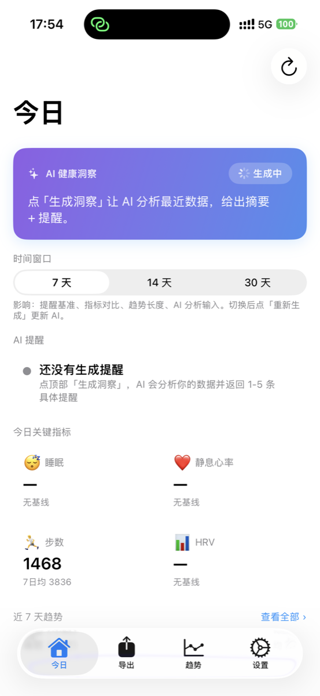
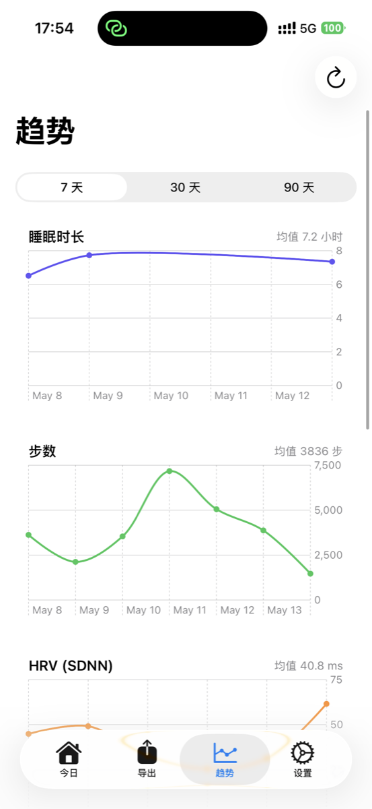
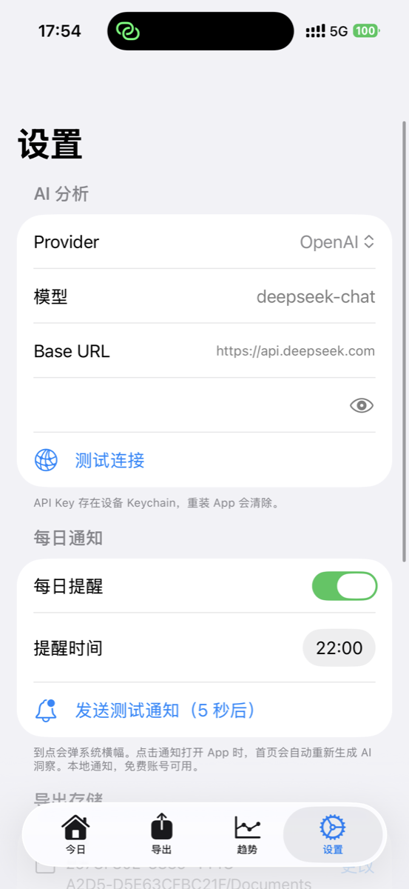

<div align="center">
  
  <h1>HealthLens</h1>
  <p>AI health analysis from your Apple Watch — private, on-device, no backend.</p>

  <p>
    <a href="https://github.com/whwhw/HealthLens/actions/workflows/build.yml">
      
    </a>
    
    
    
    
  </p>

  <p>English &nbsp;·&nbsp; <a href="README_CN.md">中文</a></p>
</div>

---

## Screenshots

<div align="center">
  
  &nbsp;&nbsp;
  
  &nbsp;&nbsp;
  
</div>


---

## Features

| | |
|---|---|
| 🧠 **AI Health Insight** | Claude or GPT-4o reads your last 7/14/30 days and writes a plain-language summary |
| 🔔 **Smart Alerts** | Model-generated alerts — not if/else rules, actual judgment on your patterns |
| 📈 **Trend Charts** | Sleep · HRV · Resting HR · Steps · Active Energy · Weight |
| ☁️ **iCloud Export** | Daily JSON export syncs to Mac automatically, no iCloud capability required |
| ⏰ **Shortcuts Automation** | Register once in iOS Shortcuts, export runs every night |
| 🔐 **Private by design** | API key in Keychain · data stays in your iCloud · no account, no backend |
| 💸 **Free account** | Works with a free Apple developer account — no $99/year needed |

---

## Quick start

**Requirements:** Xcode 16+ · iPhone with Apple Watch data · Anthropic or OpenAI API key

```bash
git clone https://github.com/whwhw/HealthLens.git
cd HealthLens
open HealthExport.xcodeproj
```

1. **Xcode → Signing & Capabilities** — set your Team, change Bundle ID to `com.yourname.healthlens`
2. Connect iPhone → select it as target → **▶ Run**
3. Grant HealthKit permissions on first launch
4. **Settings → AI Analysis** — paste your API key
5. Tap **Generate Insight** on the Home tab

> **Free account re-signing**: Xcode re-signs every 7 days. Reconnect and hit Run when it expires.

---

## iCloud Drive sync

Export daily JSON files to iCloud Drive for Mac-side analysis (e.g. feeding an AI agent).

1. **Settings → Export Storage → Change** — pick a folder inside iCloud Drive
2. App saves a security-scoped bookmark — works on free accounts, no iCloud Capability needed
3. Files appear at `~/Library/Mobile Documents/com~apple~CloudDocs/<your-folder>/`

Schema: see [`SPEC.md`](SPEC.md)

---

## Architecture

```
AppTabView
└── @EnvironmentObject: HealthStore, APIConfig, FolderStore, NotificationManager
    │
    ├── HomeView
    │   ├── HomeDataLoader   — metrics + mini-trends (receives HealthStore as param)
    │   └── InsightGenerator — prompt builder + Claude/OpenAI call
    │
    ├── ChartsView
    │   └── ChartDataLoader  — 6 time-series (receives HealthStore as param)
    │
    ├── ContentView (Export tab)
    │   └── Orchestrator     — date range → JSON pipeline
    │
    └── SettingsView
        └── APIConfig · FolderStore · NotificationManager
```

`HealthStore` is created **once** at the root and injected via `@EnvironmentObject`. No hidden singletons — all data-loading classes receive it as a method parameter.

**Zero third-party dependencies** — SwiftUI · HealthKit · Charts · UserNotifications · AppIntents · Security

---

## AI providers

Default is Anthropic Claude. Switch in Settings to any OpenAI-compatible endpoint:

| Provider | Default model | |
|---|---|---|
| Anthropic | `claude-opus-4-7` | Recommended |
| OpenAI | `gpt-4o` | |
| Custom | any | OpenAI-compatible base URL |

---

## Why I built this

Apple Health has the data. What it lacks is interpretation.

I wanted something that looks at 7 days of sleep + HRV + steps and tells me *what it means* in plain language — not a dashboard of numbers, but "your recovery looks good, but sleep consistency is dropping."

Built in 3 days with zero prior Swift experience, using Claude Code to write all the code.

---

## Contributing

See [CONTRIBUTING.md](CONTRIBUTING.md). One concern per PR, test on real device, keep zero-dependency rule.

---

## License

MIT — see [LICENSE](LICENSE).
